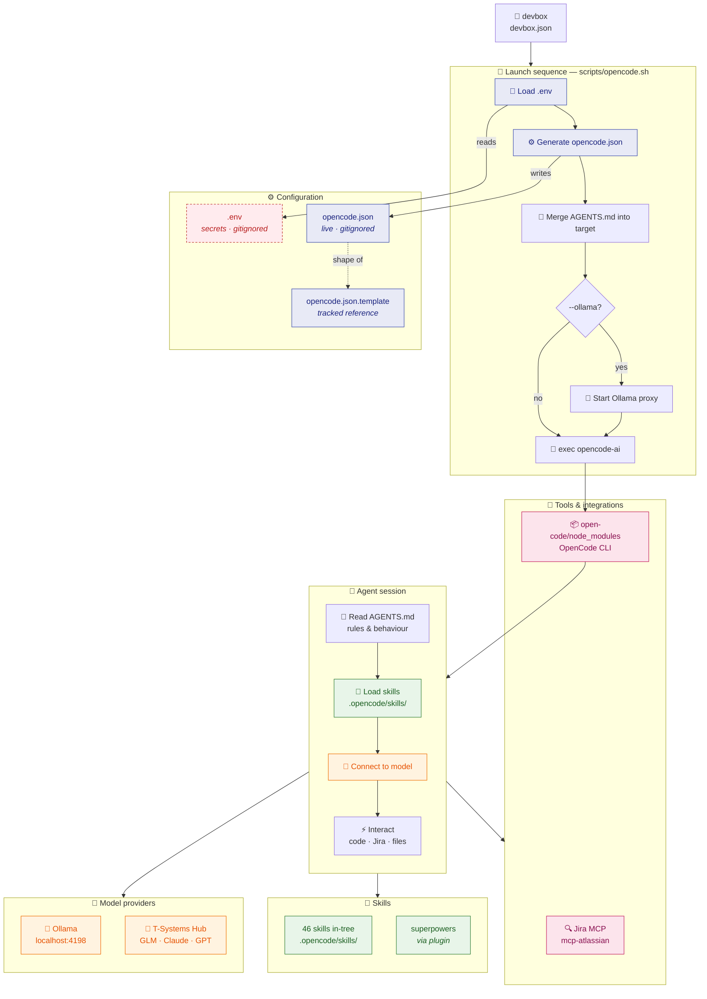

# 🚀 OpenCode (tridev)

> The minimal, ADHD-friendly way to run AI coding assistants with full Jira integration.

A local-first wrapper around the [OpenCode CLI](https://opencode.ai): one reproducible
[devbox](https://jetify.com/devbox) environment, one launcher script, model tiers declared
up front instead of auto-routed, and vendored skills committed alongside the code that uses
them. Everything runs on your machine. No CI, no service, no dashboard.

---

## Requirements

| Tool | Version | Notes |
|------|---------|-------|
| [devbox](https://jetify.com/docs/installing/devbox) | latest | Provides everything else; nothing else to install by hand |
| Ollama | optional | Only for `--ollama` mode (local model + tool calling) |

The environment pins `nodejs@22`, `python@3.11`, `uv`, `git`, `curl`, `jq@1.7` — see
[devbox.json](devbox.json). `devbox.lock` is committed, so the package set is reproducible.

---

## Setup

```bash
git clone https://github.com/sankhasil/opencode-tridev.git
cd opencode-tridev

devbox shell          # enter the pinned environment
cp .env.template .env # then fill in the values you need
```

`.env` is gitignored and never committed. Every variable is optional — leave one blank and
that integration is simply skipped. See [.env.template](.env.template) for the full list.

There is no `opencode.json` in a fresh clone. The launcher generates it on first run from
[scripts/opencode.sh](scripts/opencode.sh); it is gitignored because it embeds absolute skill
paths that are specific to your machine.

---

## Usage

```bash
devbox run opencode                             # default: free cloud model, no Ollama
devbox run opencode-ollama                      # same, plus Ollama + the tool-call proxy
devbox run opencode /path/to/project            # launch against another folder
```

Inside the `devbox shell` session these are also available as plain functions — `opencode`
and `opencode-ollama`.

There is no root `package.json`. `devbox run` is the only supported entry point.

---

## What's in the box

| Path | Purpose |
|------|---------|
| [AGENTS.md](AGENTS.md) | The instruction manual every agent session reads first |
| [scripts/opencode.sh](scripts/opencode.sh) | Launcher: reads `.env`, generates config, starts Ollama if asked, execs the CLI |
| [scripts/trinity.sh](scripts/trinity.sh) | Headless orchestrator — runs a spec through isolated agents, one path set at a time |
| [open-code/tools/](open-code/tools) | Vendored Ollama tool-call proxy ([ADR 0006](docs/adr/0006-vendor-ollama-tool-call-proxy.md)) |
| [docs/adr/](docs/adr) | Seven accepted decisions, and why |
| [docs/architecture/](docs/architecture) | Trinity orchestrator design and run contract |
| [docs/diagrams/tridev.dsl](docs/diagrams/tridev.dsl) | C4 model as code |
| [opencode.json.template](opencode.json.template) | Tracked reference for the config shape (the live `opencode.json` is gitignored) |
| [.opencode/skills/](.opencode/skills) | 46 skill packages, loaded via the relative `skills.paths` entry |

`node_modules/`, `.devbox/`, `.venv/`, `.agents/` and runtime logs are gitignored and
regenerated on demand. Tracked repo size is under 1 MB.

---

## What this is not

- Not a full OpenCode.ai installation script — it wraps the CLI, it does not replace it
- Not a CI/CD pipeline
- Not production deployment ready

It is a personal development-environment wrapper.

---

# Detailed documentation

## 🏗️ Architecture Diagram



### 🔐 Authentication

| Variable | Purpose |
|----------|---------|
| `TSYSTEMS_OPENCODE_API_KEY` | Cloud AI (T-Systems Hub) |
| `JIRA_URL` | Jira server address |
| `JIRA_USER_EMAIL` | Jira login email |
| `JIRA_API_TOKEN` | Jira personal access token |
| `JIRA_PROJECT` | Filter projects (optional) |

⚠️ All secrets live in `.env` — **never** committed. See [.env.template](.env.template)
for the full list of variable *names*.

---

## 🔧 Configuration File

Located at **`opencode.json`** (regenerated from `opencode.sh` on every launch, gitignored).
The abridged shape below lives in [`opencode.json.template`](opencode.json.template); the
launcher additionally injects `provider.tsystems.models` and `mcp` from its embedded catalog:

```json
{
  "$schema": "https://opencode.ai/config.json",
  "model": "opencode/space-bunny-free",
  "small_model": "opencode/space-bunny-free",
  "share": "disabled",
  "provider": {
    "ollama": {
      "npm": "@ai-sdk/openai-compatible",
      "name": "TIER 0 FREE - Local Ollama",
      "options": {
        "baseURL": "http://localhost:4198/v1",
        "apiKey": "ollama"
      }
    },
    "tsystems": {
      "npm": "@ai-sdk/openai-compatible",
      "name": "T-Systems LLM Hub",
      "options": {
        "baseURL": "https://llm-server.llmhub.t-systems.net/v2",
        "apiKey": "{env:TSYSTEMS_OPENCODE_API_KEY}"
      }
    }
  }
}
```

The `opencode` provider is built in and needs no key, so it does not appear above. Both
defaults point at it, so the default path starts **no local processes** — no Ollama, no
tool-call proxy, no `--ollama` flag. Local Ollama stays in the picker for when you want
offline work or local tool-calling.

> ⚠️ The default path is therefore **not offline-capable**. `small_model` only ever runs
> title generation and summaries, which is why it costs nothing to put it on the same free
> tier — but it does mean a dropped network degrades conversation titles.

---

## 🧩 Devbox Integration

```jsonc
// devbox.json (environment setup)
{
  "packages": ["nodejs@22", "python@3.11", "uv", "git"],
  "shell": {
    "scripts": {
      "opencode": "bash scripts/opencode.sh $@",
      "opencode-ollama": "bash scripts/opencode.sh --ollama $@"
    }
  }
}
```

---

## 🗂️ Documentation (OKF)

Project follows [Open Knowledge Format](https://okf.md) for structured documentation:

| Bundle | Path | Purpose |
|--------|------|---------|
| 📖 Project docs | `docs/` | Concepts, architecture, decisions |
| 🤖 Agent knowledge | `docs/agents/` | How agents should work (not user-facing) |

```
docs/
├── index.md           # 📋 Bundle index (type: concept)
├── adr/               # 📝 Architecture Decision Records — start here
├── architecture/      # 🏛️  Component designs (Trinity orchestrator)
├── diagrams/          # 📊 Structurizr DSL (source of truth) + exports
└── journal/           # 📅 Session logs & operator profile (gitignored — personal)
```

### Decision records

| ADR | Decision |
|-----|----------|
| [0001](docs/adr/0001-local-first-launcher-not-a-methodology-runtime.md) | This is a local-first launcher, not a methodology runtime |
| [0002](docs/adr/0002-declare-model-tiers-never-auto-route.md) | Declare model tiers, never auto-route |
| [0003](docs/adr/0003-parallel-agents-via-disjoint-path-sets.md) | Parallel agents via disjoint path sets, no git, no worktree |
| [0004](docs/adr/0004-jev-ai-is-not-adopted.md) | Jev AI is not adopted |
| [0005](docs/adr/0005-no-external-agent-orchestration-dependency.md) | No external agent-orchestration dependency |
| [0006](docs/adr/0006-vendor-ollama-tool-call-proxy.md) | Vendor the Ollama tool-call proxy instead of depending on it |
| [0007](docs/adr/0007-trinity-orchestrator-runs-headless-opencode-run.md) | The Trinity orchestrator runs `opencode run` headless |

> `docs/architecture.md` does not exist. The Trinity orchestrator design lives in
> `docs/architecture/trinity-orchestrator/`, and the C4 views in `docs/diagrams/tridev.dsl`.

---

## 🚦 Model Selection

Tiers are declared, never auto-routed. The launcher picks nothing at runtime — see
[ADR 0002](docs/adr/0002-declare-model-tiers-never-auto-route.md). Every model in the
`/model` picker carries its tier and EUR price in its name.

| Tier | Provider | Model | Best For |
|------|----------|-------|----------|
| **0 FREE** | `opencode` | `space-bunny-free` | **Default**, for both `model` and `small_model` |
| **0 FREE** | `ollama` | `qwen2.5-coder-tools:7b` | Optional. Local and private. Needs `--ollama`; the only tier with working tool-calling |
| **1 BUDGET** | T-Systems | `gpt-oss-120b` | Cheapest capable work, Euro0.20/0.65 |
| **2 MODERATE** | T-Systems | `Qwen3.6-35B-A3B-FP8`, `Mistral Small 4` | Good default when you need a paid model |
| **3 PREMIUM** | T-Systems | `GLM-5.2` | 1M context at Euro1.50/3.50 |
| **4–5 HIGH** | T-Systems | `claude-opus-*`, `gpt-5.4` | Hard problems only. Euro4.95–24.75/M out |

Models missing from the pricing table display as `UNPRICED - <name>`. Nothing is guessed.

> ⚠️ The OpenCode Zen free tier is quota-limited (`FreeUsageLimitError`) and documented as
> free "for a limited time". Treat tier 0 as a convenience, not a guarantee.
> Do **not** switch to `opencode/big-pickle` — it is free but the Zen docs state its data
> may be used to train the model during the free period.

> 💡 **ADHD Tip**: Leave it on tier 0. Only escalate when something actually fails.

---

## ⚡ Commands Quick Reference

```bash
devbox run opencode                 # default model, no Ollama
devbox run opencode-ollama          # with Ollama auto-start
devbox run opencode /path/to/project
```

Script-level tests, runnable without the CLI:

```bash
bash scripts/test-trinity.sh
bash scripts/test-opencode-sync.sh
```

---

## 🎯 Agent Behavior

The AI follows **Ponytail Engineering Rules** from `AGENTS.md`:

- ✅ **Smallest solution first** — Don't add features not requested
- ✅ **Use existing code** — Prefer extending over writing new
- ✅ **Minimal diffs** — Reviewable, deletable changes
- ✅ **Test behavior** — Verify before claiming complete

---

## 🔗 Jira Integration

Requires:
1. `.env` file with credentials
2. MCP (Model Context Protocol) server
3. Jira Cloud or Data Center project

```bash
# Verify Jira connection
curl -s "$JIRA_URL/rest/api/2/myself" -u "email:token"
```

---

## 📞 Contact

- Repo: [github.com/sankhasil/opencode-tridev](https://github.com/sankhasil/opencode-tridev)
- Launcher: [scripts/opencode.sh](scripts/opencode.sh)
- Decisions: [docs/adr/](docs/adr)
